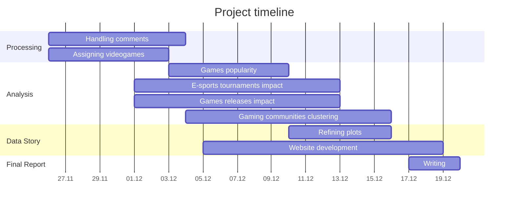

# The dynamics of gaming on YouTube : A story about games, events and communities 🎮

## Abstract

We are presented with **YouNiverse**, A large scale dataset about **channel** and **video metadata** from English-speaking **YouTube**. The dataset contains information about channels of different categories, time series of views and subcribers count, metadata of each crawled video as well as comment data accross different videos. Our story will be centered on **gaming content** on YouTube through three major angles. We will first investigate the **games** which generate the **most engagement** on the platform. Then, we'll observe the **influence** of **real-world events** in the gaming industry on the users' activity. Finally, we aim to focus on the **structural dynamics** of different **video game communities**, and the way they interact with each other.

## Authors

- Jean Perbet | 341418 | <jean.perbet@epfl.ch>
- Maxime Ducourau | 329544 | <maxime.ducourau@epfl.ch>
- Léopold Henry | 327176 | <leopold.henry@epfl.ch>
- Martin Catheland | 345421 | <martin.catheland@epfl.ch>
- Mehdi Zoghlami | 326381 | <mehdi.zoghlami@epfl.ch>

## Project structure

This project is structured as follows:

```sh
├── .gitignore
├── data                                # data sources
│   ├── (youniverse)
│   │   ├── (filtered)                  # pre-filtered youniverse files
│   │   │   ├── (gaming_channels.tsv)
│   │   │   ├── (gaming_comments.tsv)
│   │   │   ├── (gaming_timeseries.tsv)
│   │   │   └── (gaming_videos.tsv)
│   │   └── (original)                  # original youniverse dataset
│   │       ├── (df_channels_en.tsv)
│   │       ├── (df_timeseries_en.tsv)
│   │       ├── (youtube_comments.tsv)
│   │       └── (yt_metadata_en.jsonl)
│   ├── esports_tournaments.csv
│   ├── games.csv
│   └── word_alpha.txt      
├── notebooks                          
│   ├── results.ipynb                   # main analysis notebook
│   └── prefiltering.ipynb              # data prefiltering notebook
├── src                                         
│   └── utils.py                        # utility functions
├── requirements.txt                    # pip requirements file
└── README.md
```

## Run instructions

In order to run the code, you can follow these steps.

1. Download the missing YouNiverse dataset files, and include them in the project directory following the file structure above.

    | File | Description | Link | Size |
    | --- | --- | --- | --- |
    | `df_channels_en.tsv` | Channels metadata | [YouNiverse](https://zenodo.org/records/4650046) | 6 MB |
    | `df_timeseries_en.tsv` | Channels timeseries | [YouNiverse](https://zenodo.org/records/4650046) | 571 MB |
    | `youtube_comments.tsv` | Comments data | [YouNiverse](https://zenodo.org/records/4650046) | 77.2 GB |
    | `yt_metadata_en.jsonl` | Videos metadata | [YouNiverse](https://zenodo.org/records/4650046) | 13.6 GB |

2. Install the required dependencies using `pip` and the following command. Try to create a virtual environment first using either `conda` or `venv`.

    ```sh
    pip install -r requirements.txt
    ```

3. Pre-filter the datasets, running `prefiltering.ipynb` notebook. This will generate the filtered datasets that will be used in the analysis. Do not forget to use the virtual environment with all dependencies you just downloaded.

4. Run all the cells in `results.ipynb` notebook. The cells will provide insights on the data, all our explanations as well as the obtained results.

## Research questions

- What are the **most popular games** on YouTube?

- What is the **impact** of games releases on channels' activity? How do **e-sports tournaments** affect the viewing metrics of a creator?

- How is the **gaming community structured** on YouTube? What are some communities that are likely to engage with each other's content?

These questions could enhance our understanding of the gaming community's expectations and help creators adapt their content accordingly. The first question indicates which games are the most relevant for our analysis. The second one explores **external factors**, offering insight into **optimal timing** and **content choices** for creators. The last question highlights possible hidden links and provides creators with ideas for potential **collaborations, cross-promotions, or targeted content** to **connect** with **specific audience** segments.

## Additional datasets

### [E-sport Tournaments Dataset](https://www.kaggle.com/datasets/hbakker/esports-200-tournaments)

This dataset provides more insights into the esports industry and contains specific information about tournaments with large prize pools. Here are the features of interest.

- `TournamentName`: Short-hand name of the tournament. (or full name if it's short enough)
- `StartDate`: Date the tournament started.
- `EndDate`: Date the tournament ended.

### [Popular Video Games](https://www.kaggle.com/datasets/matheusfonsecachaves/popular-video-games)

This dataset is a comprehensive collection of information about most of commercial video games ever released. It serves as a valuable resource for researchers, gamers, and enthusiasts interested in exploring the evolution of the gaming industry over the past decades. The features will be using are:

- `Title`: Title of the game
- `Release_Date`: Release date of the game
- `Genres`: Genres of the game

## Methods

### Prefiltering

Given the sheer size of our data we need to reduce it as much as possible before analyzing it.

1. The initial step was to isolate all data related to the gaming category, meaning keeping only videos falling under `Gaming` category, their corresponding channels and timeseries as well as the comments posted under gaming videos.

2. The next step was to drop all columns that were not relevant to our analysis.  

### Analysis

1. For the video metadata, we want to add a new column containing the name of the videogame that is played in the video. After trying a few heuristics, we settled on a pretty simple algorithm, consisting in looking for complete game names in title and/or tags of each video.

2. At this stage of the project, we hand picked famous video games and compared their average performance metrics before and after main e-sports tounaments of the corresponding video games. We plan to extend this analysis to games releases during Milestone 3.

3. In order to understand the structure of gaming communities in YouTube we decided to create a graph where each node represents a channel and each edge represents how close are these channels in terms of their communities (In other words, to what extent do different fanbases **overlap**). We use the commment data, where the edge weights represent the number of users who commented on both channels represented by the nodes. For the time being we chose to create the graph based on **100M** comments out of **8B** as a **Proof of Concept**.

### Proposed Timeline



### Organization within the team

| Member | Tasks |
| --- | --- |
| Jean | Assigning videogames / Games popularity / Website development |
| Léopold | E-sports tournaments impact / Games releases Impact / Refining plots |
| Maxime | Handling comments / Gaming communities clustering |
| Martin | Gaming communities clustering / Website development  |
| Mehdi | General Analysis / Refining plots |

We decide to split the work between **Léopold**, **Jean** and **Mehdi**, who will primarily work on the **first research question**, and **Martin** and **Maxime**, who will focus on the **second research question**. This distribution is based on the members' preferences and skills, as well as the nature of the tasks.

Of course, everyone will participate in the final visualizations and the completion of the data story.
