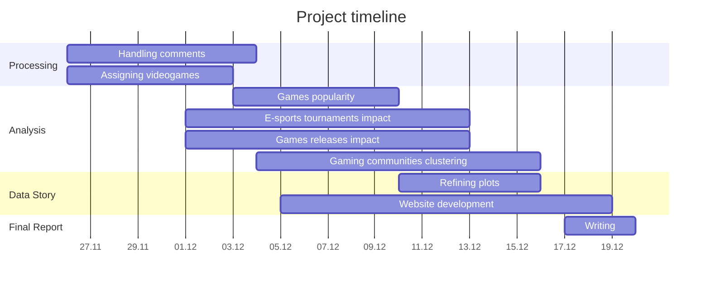

# CS-401 - Applied Data Analysis - Milestone 2

## The dynamics of Gaming on Youtube

## Authors

- Jean Perbet | 341418 | <jean.perbet@epfl.ch>
- Maxime Ducourau | 329544 | <maxime.ducourau@epfl.ch>
- Léopold Henry | 327176 | <leopold.henry@epfl.ch>
- Martin Catheland | 345421 | <martin.catheland@epfl.ch>
- Mehdi Zoghlami | 326381 | <mehdi.zoghlami@epfl.ch>

## Project structure

This project is structured as follows:

```sh
├── .gitignore
├── data                                # data sources
│   ├── (youniverse)
│   │   ├── (filtered)                  # pre-filtered youniverse files
│   │   │   ├── (gaming_channels.tsv)
│   │   │   ├── (gaming_comments.parquet)
│   │   │   ├── (gaming_timeseries.parquet)
│   │   │   └── (gaming_videos.parquet)
│   │   └── (original)                  # original youniverse dataset
│   │       ├── (df_channels_en.tsv)
│   │       ├── (df_timeseries_en.tsv)
│   │       ├── (youtube_comments.tsv)
│   │       └── (yt_metadata_en.jsonl)
│   ├── esports_tournaments.csv
│   ├── games.csv
│   └── word_alpha.txt      
├── notebooks                          
│   ├── results.ipynb                   # main analysis notebook
│   └── prefiltering.ipynb              # data prefiltering notebook
├── src       
│   └── utils.py                        # utility functions    
├── requirements.txt                    # pip requirements file
└── README.md
```

## Run instructions

In order to run the code, you can follow these steps.

1. Download the missing YouNiverse dataset files, and include them in the project directory following the file structure above.

    | File | Description | Link | Size |
    | --- | --- | --- | --- |
    | `df_channels_en.tsv` | Channels metadata | [YouNiverse](https://zenodo.org/records/4650046) | 6 MB |
    | `df_timeseries_en.tsv` | Channels timeseries | [YouNiverse](https://zenodo.org/records/4650046) | 571 MB |
    | `youtube_comments.tsv` | Comments data | [YouNiverse](https://zenodo.org/records/4650046) | 77.2 GB |
    | `yt_metadata_en.jsonl` | Videos metadata | [YouNiverse](https://zenodo.org/records/4650046) | 13.6 GB |

2. Install the required dependencies using `pip` and the following command. Try to create a virtual environment first using either `conda` or `venv`.

    ```sh
    pip install -r requirements.txt
    ```

3. Pre-filter the datasets, running `prefiltering.ipynb` notebook. This will generate the filtered datasets that will be used in the analysis. Do not forget to use the virtual environment with all dependencies you just downloaded.

4. Run all the cells in `results.ipynb` notebook. The cells will provide insights on the data, all our explanations as well as the obtained results.

## Abstract

We are presented with **YouNiverse**, A large scale dataset about **channel** and **video metadata** from English-speaking **YouTube**. The dataset contains information about channels of different categories, time series of views and subcribers count, metadata of each crawled video as well as comment data accross different videos. Our story will be centered on **gaming content** on Youtube. The main focus is about certain trends and patterns that a channel can pick up in order to grow using gaming videos. We aim to investigate two **major themes**: firstly the influence of real-world events in the gaming industry on YouTube's gaming community, and secondly the structural dynamics of different video game communities, focusing on how viewers interact and engage. Our project will explore these angles to reveal insights into growth tactics and viewer behavior that gaming channels can adopt to enhance their visibility and impact.

## Research questions

- What is the **impact** of **real life gaming events** (release of new video game, e-sports tournament...) on the youtube gaming community?

- How is the gaming **community structure** on Youtube? What are some communities that are likely to engage with each other's content?

Both questions can be fundamental towards Youtube creator's carreer in the gaming field. The first question explores an **external factor**, the dynamic relationship between real-world gaming events and YouTube engagement. By analyzing this connection, we can gauge how external events drive viewership and interaction within the platform, offering insight into **optimal timing** and **content choices** for creators.

The second question examines the **structure** of the gaming community on YouTube, identifying **sub-communities** that frequently **engage with each other's content**. This analysis can provide creators with ideas for potential **collaborations, cross-promotions, or targeted content** to **connect** with **specific audience** segments, ultimately fostering a more interconnected and engaged community.

Together, these insights can provide a view of strategies for growth, timing, and community engagement that are vital for a successful content in gaming.

## Additional datasets

### [E-sport Tournaments Dataset](https://www.kaggle.com/datasets/hbakker/esports-200-tournaments)

This dataset provides more insights into the esports industry and contains specific information about tournaments with large prize pools. The main features that we will be using are:

- `TournamentName`: Short-hand name of the tournament. (or full name if it's short enough)
- `StartDate`: Date the tournament started.
- `EndDate`: Date the tournament ended.

This dataset will be used in order to study the impact of big e-sports tournament on the gaming ecosystem on Youtube, and how these real life events drive engagament and views on Youtube.

### [Popular Video Games](https://www.kaggle.com/datasets/matheusfonsecachaves/popular-video-games)

This dataset acts as a comprehensive collection of information about some of the most popular video games released. It serves as a valuable resource for researchers, gamers, and enthusiasts interested in exploring the evolution of the gaming industry over the past decades. The features will be using are:

- `Title`: Title of the game
- `Release_Date`: Release date of the game
- `Genres`: Genres of the game

This dataset will be used in order to classify the gaming channels according to which game is played in the video, and to analyse the impact of video games releases on YouTube activity.

## Methods

### Prefiltering

Given the sheer size of our data we need to reduce it as much as possible before analyzing it.

1. The initial step was to drop all columns that were not relevant to our analysis.  

2. The next step was to isolate all data related to the gaming category, meaning keeping only videos falling under `Gaming` category and their corresponding channels as well as the comments posted under gaming videos.

3. For the video metadata, we want to add a new column containing the name of the videogame that is played in the video. We use a simple algorithm for this purpose: we start by looking if a game name is contained in the title. If it is, we assign the video to this game. If not, apply the same procedure to the tags. If there is no game or several games in the tags, we do not assign the video

### Analysis

1. At this stage of the project we hand picked famous video games, plotted their average generated views over time and then compared these plots with e-sports tounaments of the corresponding video games. This analysis shows that e-sports tounament have a real impact on viewerships in Youtube and offers a lead for a more in depth analysis in Milestone 3.

2. In order to understand the structure of gaming communities on YouTube we decided to create a graph where each node represents a video game and each edge represents how close are these video games in terms of their communities (In other words, to what extent do different videos games' communities **overlap**). This graph will be created based on the commments data where the edge weights represent the number of users that commented on both video games represented by the nodes. A similar graph representing community proximity between **creators** will also be added. For the time being we chose to create the graph based only on **100M** comments as a **Proof of Concept**.

### Proposed Timeline



### Organization within the team

| Member | Tasks |
| --- | --- |
| Jean | Assigning videogames / Games popularity / Website development |
| Léopold | E-sports tournaments impact / Games releases Impact / Refining plots |
| Maxime | Handling comments / Gaming communities clustering |
| Martin | Gaming communities clustering / Website development  |
| Mehdi | General Analysis / Refining plots |

We decide to split the work between **Léopold**, **Jean** and **Mehdi**, who will primarily work on the **first research question**, and **Martin** and **Maxime**, who will focus on the **second research question**. This distribution is based on the members' preferences and skills, as well as the nature of the tasks.

Of course, everyone will participate in the final visualizations and the completion of the data story.
